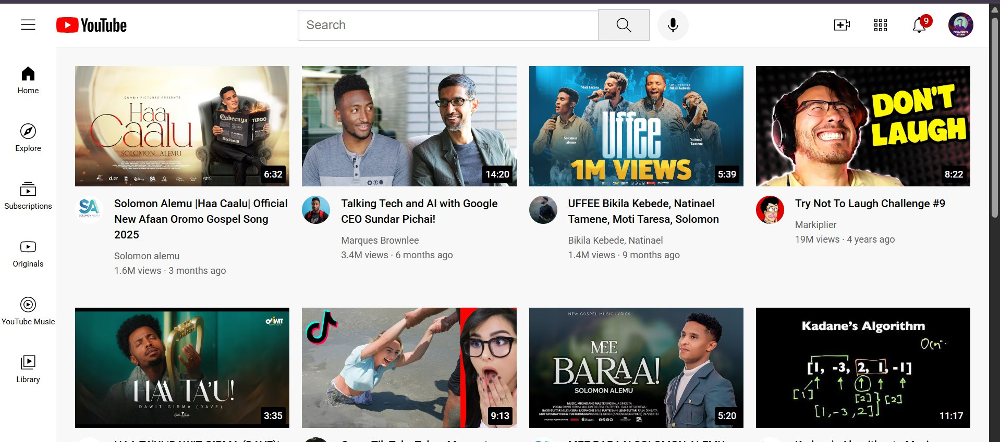

# YouTube.com Clone 🎥

This is a responsive front-end clone of the YouTube homepage, built with HTML and CSS. It mimics the layout, sidebar, header, and video grid of YouTube, including interactive tooltips and clickable video previews.

## 🚀 Live Demo

👉 [View it on browser](https://bati58.github.io/youtube.com-clone/)

## 🧰 Tech Stack

- HTML5
- CSS3 (Modular: `header.css`, `sidebar.css`, `video.css`, `general.css`)

